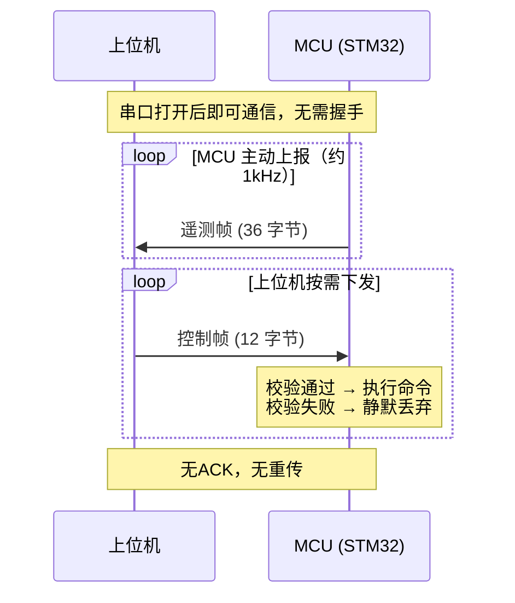
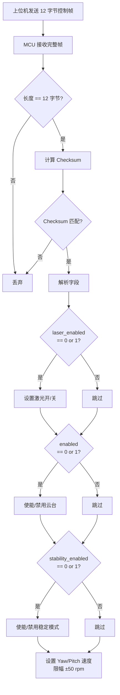
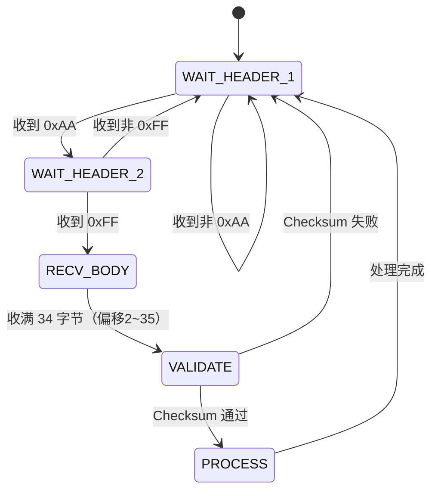

# QGimbal 串口通信协议文档

> **版本**: v1.0  
> **适用对象**: 上位机开发人员  
> **生成依据**: 基于 MCU 端代码实际实现（`application/TransmitTask.cpp`）  
> **最后更新**: 2026-05-29

---

## 1. 协议概述

QGimbal 云台系统采用**点对点双向串口通信协议**，上位机与 MCU 之间通过 UART 进行数据交换。

| 特性         | 说明                              |
|:-------------|:----------------------------------|
| 通信方向     | 双向（上位机 ↔ MCU）              |
| 帧类型       | 2种固定帧（遥测帧 + 控制帧）       |
| 帧同步       | 遥测帧使用帧头 `0xAA 0xFF`        |
| 校验方式     | 字节累加和（Checksum）             |
| ACK 机制     | 无                                |
| 重传机制     | 无                                |
| 字节序       | **Little-Endian**                 |
| 数据编码     | 原始二进制（不做转义）             |

### 通信方向定义

| 方向            | 帧名称         | 说明               |
|:----------------|:---------------|:-------------------|
| MCU → 上位机    | 遥测帧（TX）    | 云台状态数据上报    |
| 上位机 → MCU    | 控制帧（RX）    | 云台控制指令下发    |

---

## 2. UART 配置参数

上位机串口必须按以下参数配置：

| 参数     | 值            |
|:---------|:-------------|
| 波特率   | **1,152,000** bps |
| 数据位   | 8 bit         |
| 停止位   | 1 bit         |
| 校验位   | None          |
| 流控     | None          |

---

## 3. 帧结构定义

### 3.1 遥测帧（MCU → 上位机）

MCU 以约 **1kHz** 的频率主动发送遥测帧，每帧 **36 字节**。

> 帧长度说明：源码中 `TransmitPackage` 结构体的 `uint8_t header[2]` 后紧跟 `float` 类型字段，ARM Cortex-M4 默认 4 字节对齐，编译器在偏移 2~3 处自动插入 2 字节填充（padding），因此 `sizeof(TransmitPackage) = 36`。

#### 帧格式

```
字节偏移:  0    1    2    3    4         7    8        11   12       15
        ┌────┬────┬─────────┬────────────┬────────────┬────────────┐
        │0xAA│0xFF│ padding │imu_angle[0]│imu_angle[1]│imu_angle[2]│
        │ 1B │ 1B │   2B    │  float 4B  │  float 4B  │  float 4B  │
        └────┴────┴─────────┴────────────┴────────────┴────────────┘

字节偏移: 16       19   20        23   24           27   28             31
        ┌────────────┬────────────┬──────────────┬────────────────┐
        │yaw_imu_ang │pitch_imu_a │yaw_motor_ang │pitch_motor_ang │
        │  float 4B  │  float 4B  │   float 4B   │    float 4B    │
        └────────────┴────────────┴──────────────┴────────────────┘

字节偏移: 32        33       34              35
        ┌─────────┬────────┬───────────────┬──────────┐
        │ laser   │enabled │stability_en   │check_sum │
        │   1B    │  1B    │     1B        │    1B    │
        └─────────┴────────┴───────────────┴──────────┘
```

#### 字段说明表

| 偏移 | 长度 | 字段名              | 数据类型       | 单位 | 说明                                     |
|-----:|-----:|:---------------------|:--------------|:----:|:-----------------------------------------|
|    0 |    1 | `header[0]`          | uint8_t       | -    | 帧头，固定 `0xAA`                         |
|    1 |    1 | `header[1]`          | uint8_t       | -    | 帧头，固定 `0xFF`                         |
|    2 |    2 | *(padding)*          | -             | -    | 编译器对齐填充，值不确定，**忽略此字段**    |
|    4 |    4 | `imu_angles[0]`      | float (LE)    | rad  | IMU 原始 Yaw 角度                         |
|    8 |    4 | `imu_angles[1]`      | float (LE)    | rad  | IMU 原始 Pitch 角度                       |
|   12 |    4 | `imu_angles[2]`      | float (LE)    | rad  | IMU 原始 Roll 角度                        |
|   16 |    4 | `yaw_imu_angle`      | float (LE)    | rad  | 云台末端 Yaw IMU 角度                     |
|   20 |    4 | `pitch_imu_angle`    | float (LE)    | rad  | 云台末端 Pitch IMU 角度（含电机补偿）      |
|   24 |    4 | `yaw_motor_angle`    | float (LE)    | rad  | Yaw 电机磁编码器角度，范围 [0, 2π)        |
|   28 |    4 | `pitch_motor_angle`  | float (LE)    | rad  | Pitch 电机磁编码器角度，范围 [0, 2π)      |
|   32 |    1 | `laser_enabled`      | uint8_t       | -    | 激光状态：`0`=关, `1`=开                  |
|   33 |    1 | `enabled`            | uint8_t       | -    | 云台使能状态：`0`=关, `1`=开              |
|   34 |    1 | `stability_enabled`  | uint8_t       | -    | 稳定模式状态：`0`=关, `1`=开              |
|   35 |    1 | `check_sum`          | uint8_t       | -    | 校验和（见第4节）                         |

#### 字段语义补充

| 字段                 | 详细说明                                                                 |
|:---------------------|:-------------------------------------------------------------------------|
| `imu_angles[0..2]`   | 由 Mahony AHRS 姿态解算输出的欧拉角，分别为 Yaw/Pitch/Roll              |
| `yaw_imu_angle`      | 经云台控制逻辑处理后的 Yaw 目标角度参考值                                |
| `pitch_imu_angle`    | IMU Pitch 角度 + Pitch 电机磁编角度（因 IMU 安装在 Yaw 轴上的补偿）      |
| `yaw_motor_angle`    | QD4310 Yaw 电机反馈的绝对角度                                            |
| `pitch_motor_angle`  | QD4310 Pitch 电机反馈的绝对角度                                          |

---

### 3.2 控制帧（上位机 → MCU）

上位机按需发送控制帧，每帧 **12 字节**。

> `ReceivePackage` 结构体以 `float` 开头，自然 4 字节对齐，无填充。

#### 帧格式

```
字节偏移:  0           3    4             7    8        9       10             11
        ┌──────────────┬────────────────┬────────┬────────┬──────────────┬──────────┐
        │  yaw_speed   │  pitch_speed   │ laser  │enabled │stability_en  │check_sum │
        │  float  4B   │  float   4B    │  1B    │  1B    │     1B       │    1B    │
        └──────────────┴────────────────┴────────┴────────┴──────────────┴──────────┘
```

#### 字段说明表

| 偏移 | 长度 | 字段名              | 数据类型       | 单位 | 有效范围            | 说明                           |
|-----:|-----:|:---------------------|:-------------|:----:|:-------------------|:-------------------------------|
|    0 |    4 | `yaw_speed`          | float (LE)   | rpm  | [-50.0, 50.0]       | Yaw 轴目标速度（MCU 端限幅±50） |
|    4 |    4 | `pitch_speed`        | float (LE)   | rpm  | [-50.0, 50.0]       | Pitch 轴目标速度（MCU 端限幅±50）|
|    8 |    1 | `laser_enabled`      | uint8_t      | -    | 0 / 1 / 其他        | 激光控制                        |
|    9 |    1 | `enabled`            | uint8_t      | -    | 0 / 1 / 其他        | 云台使能控制                    |
|   10 |    1 | `stability_enabled`  | uint8_t      | -    | 0 / 1 / 其他        | 稳定模式控制                    |
|   11 |    1 | `check_sum`          | uint8_t      | -    | 0x00~0xFF           | 校验和（见第4节）               |

#### 控制字段取值语义

`laser_enabled`、`enabled`、`stability_enabled` 三个字段采用**三态控制**设计：

| 值     | 含义                                       |
|:-------|:-------------------------------------------|
| `0x00` | **关闭**对应功能                            |
| `0x01` | **开启**对应功能                            |
| 其他   | **不操作** — 保持 MCU 当前状态，不做任何修改 |

这种设计允许上位机**选择性**地只控制部分功能。例如：只改变速度而不影响激光和使能状态时，将控制字段设为 `0xFF`。

#### 速度限幅说明

MCU 端对速度进行硬限幅处理：

```
实际速度 = clamp(接收速度, -50.0, 50.0)
```

超出 ±50 rpm 的速度值会被截断到边界值，不会导致错误或帧丢弃。

---

## 4. 校验算法

两个方向使用**相同的校验算法** — 简单字节累加和。

### 算法定义

```
Checksum = ( Σ packet[0 .. N-2] ) mod 256
```

即：对帧中**除最后1字节（check_sum 自身）外**的所有字节逐个累加，结果取低 8 位。

### 伪代码

```python
def calc_checksum(data: bytes) -> int:
    """计算校验和，data 为不含 check_sum 字段的帧数据"""
    checksum = 0
    for byte in data:
        checksum = (checksum + byte) & 0xFF
    return checksum
```

### Python 实现示例

```python
import struct

def build_control_frame(yaw_speed: float, pitch_speed: float,
                        laser: int = 0xFF, enabled: int = 0xFF,
                        stability: int = 0xFF) -> bytes:
    """构建控制帧（上位机 → MCU）"""
    payload = struct.pack('<ff', yaw_speed, pitch_speed)
    payload += bytes([laser, enabled, stability])
    checksum = sum(payload) & 0xFF
    return payload + bytes([checksum])

def parse_telemetry_frame(data: bytes) -> dict:
    """解析遥测帧（MCU → 上位机），data 为 36 字节"""
    if len(data) != 36:
        return None
    if data[0] != 0xAA or data[1] != 0xFF:
        return None
    # 校验
    expected_checksum = sum(data[:35]) & 0xFF
    if expected_checksum != data[35]:
        return None
    # 解析（跳过偏移 2~3 的 padding）
    imu_yaw, imu_pitch, imu_roll = struct.unpack_from('<fff', data, 4)
    yaw_imu_angle, pitch_imu_angle = struct.unpack_from('<ff', data, 16)
    yaw_motor_angle, pitch_motor_angle = struct.unpack_from('<ff', data, 24)
    laser_enabled = data[32]
    enabled = data[33]
    stability_enabled = data[34]
    return {
        'imu_yaw': imu_yaw,
        'imu_pitch': imu_pitch,
        'imu_roll': imu_roll,
        'yaw_imu_angle': yaw_imu_angle,
        'pitch_imu_angle': pitch_imu_angle,
        'yaw_motor_angle': yaw_motor_angle,
        'pitch_motor_angle': pitch_motor_angle,
        'laser_enabled': laser_enabled,
        'enabled': enabled,
        'stability_enabled': stability_enabled,
    }
```

### C/C++ 实现示例

```c
uint8_t calc_checksum(const uint8_t *data, size_t len) {
    uint8_t sum = 0;
    for (size_t i = 0; i < len; i++) {
        sum += data[i];
    }
    return sum;
}
```

---

## 5. 通信流程

### 5.1 整体通信流程



### 5.2 控制帧处理流程



### 5.3 遥测帧解析流程

```mermaid
flowchart TD
    A[接收串口数据] --> B{帧长 == 36 字节?}
    B -->|否| C[丢弃，等待下一帧]
    B -->|是| D{data[0]==0xAA<br>data[1]==0xFF?}
    D -->|否| C
    D -->|是| E[计算 Checksum<br>sum of data 0..34]
    E --> F{== data[35]?}
    F -->|否| C
    F -->|是| G[解析各字段<br>注意跳过偏移2~3的padding]
    G --> H[更新UI / 记录数据]
```

---

## 6. 收发示例

### 6.1 控制帧示例

**场景**：设置 Yaw 速度 10.0 rpm，Pitch 速度 -5.0 rpm，开启激光，使能云台，不改变稳定模式。

```
字段                值              IEEE754 / Hex
─────────────────────────────────────────────────
yaw_speed         = 10.0           → 00 00 20 41
pitch_speed       = -5.0           → 00 00 A0 C0
laser_enabled     = 1 (开)         → 01
enabled           = 1 (开)         → 01
stability_enabled = 0xFF (不操作)   → FF
─────────────────────────────────────────────────
checksum = (00+00+20+41+00+00+A0+C0+01+01+FF) & 0xFF
         = 0x22 (推测值，实际请以计算结果为准)

完整帧 Hex:
00 00 20 41 00 00 A0 C0 01 01 FF [checksum]
```

实际计算过程：

```
0x00 + 0x00 + 0x20 + 0x41 + 0x00 + 0x00 + 0xA0 + 0xC0 + 0x01 + 0x01 + 0xFF
= 0 + 0 + 32 + 65 + 0 + 0 + 160 + 192 + 1 + 1 + 255
= 706
= 706 & 0xFF
= 0xC2

完整帧 Hex（12字节）:
00 00 20 41 00 00 A0 C0 01 01 FF C2
```

### 6.2 控制帧示例 — 仅改速度

**场景**：设置 Yaw 速度 0 rpm（停止），Pitch 速度 0 rpm（停止），所有控制位不操作。

```
yaw_speed         = 0.0            → 00 00 00 00
pitch_speed       = 0.0            → 00 00 00 00
laser_enabled     = 0xFF           → FF
enabled           = 0xFF           → FF
stability_enabled = 0xFF           → FF

checksum = (00+00+00+00+00+00+00+00+FF+FF+FF) & 0xFF
         = (255*3) & 0xFF = 765 & 0xFF = 0xFD

完整帧 Hex（12字节）:
00 00 00 00 00 00 00 00 FF FF FF FD
```

### 6.3 控制帧示例 — 紧急停止

**场景**：速度归零，关闭激光，禁用云台，禁用稳定模式。

```
yaw_speed         = 0.0            → 00 00 00 00
pitch_speed       = 0.0            → 00 00 00 00
laser_enabled     = 0              → 00
enabled           = 0              → 00
stability_enabled = 0              → 00

checksum = 0x00

完整帧 Hex（12字节）:
00 00 00 00 00 00 00 00 00 00 00 00
```

### 6.4 遥测帧解析示例

假设收到如下 36 字节数据：

```
AA FF 00 00 DB 0F 49 40 00 00 00 00 00 00 00 00
DB 0F 49 40 00 00 00 3F C3 F5 48 40 DB 0F C9 40
01 01 01 XX
```

逐字段解析：

| 偏移 | Hex 值           | 字段              | 解析值                        |
|-----:|:-----------------|:------------------|:------------------------------|
|    0 | `AA`             | header[0]         | 0xAA ✓                       |
|    1 | `FF`             | header[1]         | 0xFF ✓                       |
|  2-3 | `00 00`          | padding           | 忽略                          |
|  4-7 | `DB 0F 49 40`    | imu_angles[0]     | 3.14159 rad (≈π)             |
| 8-11 | `00 00 00 00`    | imu_angles[1]     | 0.0 rad                      |
|12-15 | `00 00 00 00`    | imu_angles[2]     | 0.0 rad                      |
|16-19 | `DB 0F 49 40`    | yaw_imu_angle     | 3.14159 rad                  |
|20-23 | `00 00 00 3F`    | pitch_imu_angle   | 0.5 rad                      |
|24-27 | `C3 F5 48 40`    | yaw_motor_angle   | 3.14 rad                     |
|28-31 | `DB 0F C9 40`    | pitch_motor_angle | 6.28318 rad (≈2π)            |
|   32 | `01`             | laser_enabled     | 1 (开)                       |
|   33 | `01`             | enabled           | 1 (云台使能)                  |
|   34 | `01`             | stability_enabled | 1 (稳定模式开)                |
|   35 | `XX`             | check_sum         | 与计算值比较                  |

---

## 7. 帧同步策略

### 7.1 上位机接收遥测帧的同步方法

遥测帧以固定帧头 `0xAA 0xFF` 开始。上位机推荐使用如下**状态机**进行帧同步：



### 7.2 帧同步伪代码

```python
class FrameParser:
    HEADER = bytes([0xAA, 0xFF])
    FRAME_LEN = 36

    def __init__(self):
        self.buffer = bytearray()

    def feed(self, data: bytes):
        """喂入串口原始字节流，返回解析出的帧列表"""
        self.buffer.extend(data)
        frames = []
        while True:
            # 寻找帧头
            idx = self.buffer.find(self.HEADER)
            if idx == -1:
                # 保留最后1字节（可能是不完整的帧头）
                if len(self.buffer) > 1:
                    self.buffer = self.buffer[-1:]
                break
            # 丢弃帧头之前的字节
            if idx > 0:
                self.buffer = self.buffer[idx:]
            # 检查是否有完整帧
            if len(self.buffer) < self.FRAME_LEN:
                break
            frame = bytes(self.buffer[:self.FRAME_LEN])
            # 校验
            checksum = sum(frame[:35]) & 0xFF
            if checksum == frame[35]:
                frames.append(frame)
                self.buffer = self.buffer[self.FRAME_LEN:]
            else:
                # 校验失败，跳过这个帧头，继续搜索
                self.buffer = self.buffer[1:]
        return frames
```

### 7.3 MCU 接收控制帧的同步方法

MCU 端使用 UART IDLE 空闲检测进行帧分割。上位机发送控制帧时需注意：

- 每帧 **12 字节必须连续发送**，中间不能有间隔
- 两帧之间需有**短暂的空闲间隔**（至少 1 个字节时间 ≈ 8.7μs @ 1.152Mbps）
- MCU 仅接受长度恰好为 12 字节的帧，其他长度直接丢弃

---

## 8. 错误处理

| 错误类型       | MCU 端行为               | 上位机建议处理              |
|:---------------|:------------------------|:---------------------------|
| Checksum 失败  | 静默丢弃，不回复         | 无法感知，依赖持续发送       |
| 帧长度不匹配   | 静默丢弃，不回复         | 确保帧长度正确              |
| 速度超限       | 自动限幅到 ±50 rpm       | 建议发送前在上位机端也做限幅  |
| 帧头不匹配     | -（MCU接收端不检查帧头）  | 上位机解析遥测帧时校验帧头   |
| 通信中断       | MCU 维持最后一次控制状态  | 建议定期发送心跳/停止命令    |

> **重要提示**：MCU 没有超时保护机制。如果上位机断开连接，MCU 会继续执行最后一次收到的速度命令。上位机应在断开前发送"速度归零"帧。

---

## 9. 快速参考表

### 控制帧（上位机 → MCU）— 12 字节

```
Offset  Size  Type      Field               Description
------  ----  --------  ------------------  ---------------------------
  0      4    float LE  yaw_speed           Yaw速度 (rpm), ±50限幅
  4      4    float LE  pitch_speed         Pitch速度 (rpm), ±50限幅
  8      1    uint8     laser_enabled       0=关, 1=开, 其他=不操作
  9      1    uint8     enabled             0=关, 1=开, 其他=不操作
 10      1    uint8     stability_enabled   0=关, 1=开, 其他=不操作
 11      1    uint8     check_sum           sum(byte[0..10]) & 0xFF
```

### 遥测帧（MCU → 上位机）— 36 字节

```
Offset  Size  Type      Field               Description
------  ----  --------  ------------------  ---------------------------
  0      1    uint8     header[0]           固定 0xAA
  1      1    uint8     header[1]           固定 0xFF
  2      2    -         (padding)           对齐填充，忽略
  4      4    float LE  imu_angles[0]       IMU Yaw (rad)
  8      4    float LE  imu_angles[1]       IMU Pitch (rad)
 12      4    float LE  imu_angles[2]       IMU Roll (rad)
 16      4    float LE  yaw_imu_angle       末端Yaw角度 (rad)
 20      4    float LE  pitch_imu_angle     末端Pitch角度 (rad)
 24      4    float LE  yaw_motor_angle     Yaw电机角度 (rad) [0,2π)
 28      4    float LE  pitch_motor_angle   Pitch电机角度 (rad) [0,2π)
 32      1    uint8     laser_enabled       0=关, 1=开
 33      1    uint8     enabled             0=关, 1=开
 34      1    uint8     stability_enabled   0=关, 1=开
 35      1    uint8     check_sum           sum(byte[0..34]) & 0xFF
```

---

## 附录：常用 IEEE 754 浮点数参考

| 十进制值  | Little-Endian Hex   |
|----------:|:--------------------|
|     0.0   | `00 00 00 00`       |
|     1.0   | `00 00 80 3F`       |
|    -1.0   | `00 00 80 BF`       |
|     5.0   | `00 00 A0 40`       |
|    -5.0   | `00 00 A0 C0`       |
|    10.0   | `00 00 20 41`       |
|   -10.0   | `00 00 20 C1`       |
|    50.0   | `00 00 48 42`       |
|   -50.0   | `00 00 48 C2`       |
|  3.14159  | `DB 0F 49 40`       |
|  6.28318  | `DB 0F C9 40`       |
