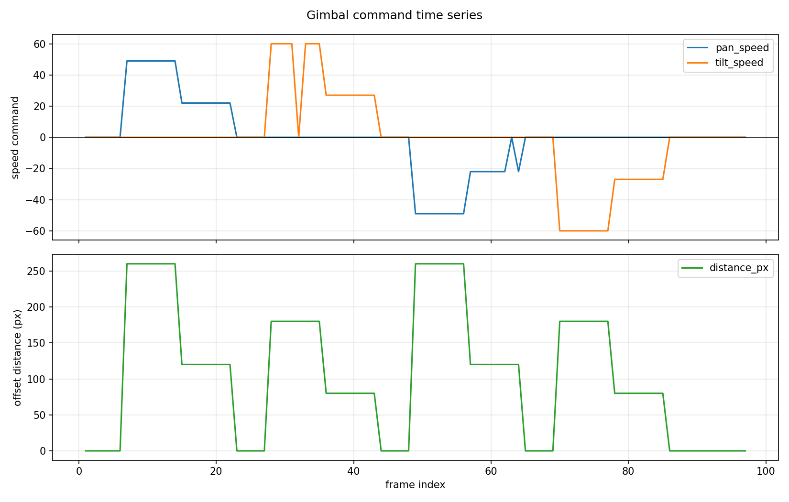
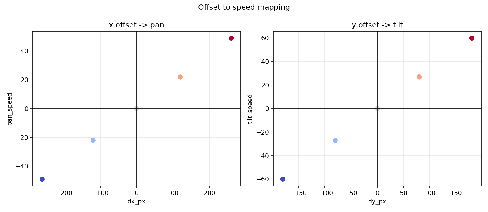
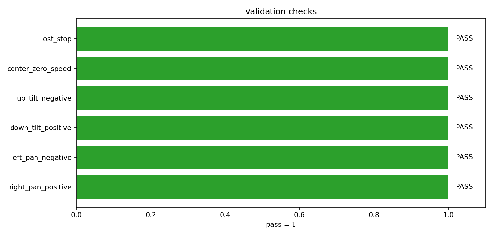

# 云台闭环验证报告

## 1. 验证结论

- 验证模式：dry_run
- TRACK 包数量：80
- STOP 包数量：3
- 记录到的成功发送包：83
- 失败发送包：0
- 方向与 STOP 检查：通过
- 真实硬件闭环：未完成

## 2. 证据缺口

- 未连接可识别的下位机反馈/真实云台画面闭环；本次为上位机协议 dry-run 验证。

## 3. 检查项

| 检查项 | 结果 |
| --- | --- |
| right_pan_positive | PASS |
| left_pan_negative | PASS |
| down_tilt_positive | PASS |
| up_tilt_negative | PASS |
| center_zero_speed | PASS |
| lost_stop | PASS |

## 4. 可视化

## 5. 解读

- `command_timeseries.png` 用于观察 pan/tilt 命令是否随模拟目标偏移变化，并在居中或 LOST 时归零。
- `offset_speed_mapping.png` 用于确认 dx 与 pan、dy 与 tilt 的符号关系是否正确。
- `validation_checks.png` 汇总方向、居中归零、LOST STOP 等基础检查是否通过。

## 6. 下一步真实闭环要求

1. 接入真实下位机串口，不使用 dry-run。
2. 下位机打印解析日志，确认 CRC、TRACK、STOP 正常。
3. 低速接入电机，确认 pan/tilt 方向。
4. 启动 `lock_target_realtime.py --gimbal-port COMx`，观察 `control_distance_to_center` 是否随云台运动下降。